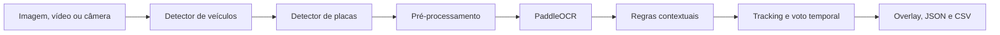

<h1 align="center">Mercosul ANPR</h1>

<p align="center">
  Reconhecimento local de placas brasileiras em imagens, vídeos e câmera ao vivo.
</p>

<p align="center">
  <a href="https://github.com/luancesarcode/mercosul-anpr/actions/workflows/ci.yml"></a>
  <a href="LICENSE"></a>
  <a href="pyproject.toml"></a>
  
</p>

<p align="center">
  <a href="#demonstração">Demonstração</a> •
  <a href="#início-rápido">Início rápido</a> •
  <a href="#câmera-ao-vivo">Câmera</a> •
  <a href="#api-local">API</a> •
  <a href="docs/ARCHITECTURE.md">Arquitetura</a>
</p>

O Mercosul ANPR combina YOLO, PaddleOCR, tracking e voto temporal para detectar veículos, localizar placas e consolidar leituras. A aplicação oferece CLI, API REST e uma interface web responsiva, mantendo entradas, frames da câmera e resultados na própria máquina.

> [!IMPORTANT]
> O projeto está em estágio alpha. A suíte automatizada verifica comportamento e regressões, mas precisão de produção exige benchmark com dados representativos e autorizados. Não utilize o sistema isoladamente para fiscalização, segurança ou identificação de pessoas.

## Demonstração

Os espaços abaixo fazem parte do layout oficial do projeto. Eles permanecem reservados até existirem mídias com autorização, licença e revisão de privacidade.

<table>
  <tr>
    <th width="33%">Envio de arquivo</th>
    <th width="34%">Câmera em tempo real</th>
    <th width="33%">Resultado consolidado</th>
  </tr>
  <tr>
    <td align="center"><br><em>Screenshot reservada</em><br><br><code>docs/media/images/interface-upload.webp</code><br><br></td>
    <td align="center"><br><em>Screenshot reservada</em><br><br><code>docs/media/images/camera-tempo-real.webp</code><br><br></td>
    <td align="center"><br><em>Screenshot reservada</em><br><br><code>docs/media/images/interface-resultado.webp</code><br><br></td>
  </tr>
</table>

<table>
  <tr>
    <th width="50%">Entrada autorizada</th>
    <th width="50%">Detecção e OCR</th>
  </tr>
  <tr>
    <td align="center"><br><em>Comparação reservada</em><br><br><code>docs/media/images/exemplo-entrada.webp</code><br><br></td>
    <td align="center"><br><em>Comparação reservada</em><br><br><code>docs/media/images/exemplo-resultado.webp</code><br><br></td>
  </tr>
</table>

### Vídeo e GIF demonstrativos

<table>
  <tr>
    <th width="50%">Vídeo completo</th>
    <th width="50%">Prévia rápida</th>
  </tr>
  <tr>
    <td align="center"><br><em>Espaço reservado para instalação, upload e câmera.</em><br><br><code>docs/media/videos/demonstracao.mp4</code><br><br></td>
    <td align="center"><br><em>Espaço reservado para o fluxo em poucos segundos.</em><br><br><code>docs/media/gifs/fluxo-completo.gif</code><br><br></td>
  </tr>
</table>

Consulte a [política de mídia](docs/media/README.md) antes de adicionar qualquer arquivo visual.

## Recursos

| Área | Capacidades |
| --- | --- |
| Detecção | Veículos e placas com YOLO, busca global, ROI por veículo e fallback para placa isolada |
| OCR | PaddleOCR, upscale, CLAHE, binarização, deskew pela faixa azul e múltiplas variantes |
| Correção | Conversões contextuais ponderadas, limite contra correções excessivas e confiança ajustada |
| Vídeo | Tracking por IoU, associação placa/veículo, suavização de caixas e voto temporal |
| Câmera | Acesso pelo navegador, seleção de dispositivo, frames sequenciais e resultado anotado ao vivo |
| Produtos | CLI instalável, API OpenAPI, interface web e resultados JSON/CSV versionados |
| Operação | Jobs locais, limites de upload, timeout, retenção, métricas e chave de API opcional |
| Qualidade | Ruff, pytest, cobertura mínima de 85%, build do pacote e CI no GitHub Actions |

## Arquitetura



A CLI, a API e a câmera reutilizam o mesmo serviço de aplicação e os mesmos modelos carregados. Sessões de câmera preservam o estado temporal entre frames sem criar arquivos intermediários. Veja [docs/ARCHITECTURE.md](docs/ARCHITECTURE.md).

## Início rápido

Requisitos: Git e Python 3.10 ou 3.11 de 64 bits.

### Windows PowerShell

```powershell
git clone https://github.com/luancesarcode/mercosul-anpr.git
cd mercosul-anpr
.\install.ps1 -Dev
.\.venv311\Scripts\Activate.ps1
mercosul-anpr-api
```

### Windows CMD

```bat
git clone https://github.com/luancesarcode/mercosul-anpr.git
cd mercosul-anpr
install.bat
.venv311\Scripts\activate.bat
mercosul-anpr-api
```

Abra [http://localhost:8000](http://localhost:8000). A documentação interativa fica em [http://localhost:8000/docs](http://localhost:8000/docs).

Na primeira execução, o PaddleOCR pode baixar modelos internos para o cache do usuário.

## Câmera ao vivo

1. Abra a interface em `http://localhost:8000`.
2. Selecione **Câmera ao vivo**.
3. Clique em **Ativar câmera** e autorize o navegador.
4. Escolha o dispositivo desejado e clique em **Iniciar análise**.
5. Mantenha o veículo estável por alguns frames para o voto temporal consolidar a leitura.
6. Clique em **Encerrar** para fechar a sessão e liberar a câmera.

O frontend redimensiona e comprime cada frame antes do envio. O próximo frame só é capturado quando o anterior termina, evitando fila crescente e consumo descontrolado de memória. A sessão é mantida em memória, aceita apenas um cliente local por vez e expira automaticamente quando fica inativa.

> [!NOTE]
> `getUserMedia` funciona em contexto seguro. `localhost` é aceito pelos navegadores modernos; ao acessar de outro dispositivo pela rede, configure HTTPS.

## CLI

```powershell
mercosul-anpr Imagens_input\minha-imagem.jpg
mercosul-anpr Videos_input\meu-video.mp4 --print-json
```

Os artefatos são gravados em `runs/predict/`:

```text
entrada.jpg|mp4   mídia anotada
entrada.txt       resultado legível
entrada.json      contrato completo por frame
entrada.csv       uma linha consolidada por veículo/placa
```

## API local

| Método | Endpoint | Finalidade |
| --- | --- | --- |
| `GET` | `/health` | Disponibilidade do serviço |
| `GET` | `/version` | Versão da aplicação |
| `GET` | `/metrics` | Métricas locais em formato Prometheus |
| `POST` | `/api/v1/process/image` | Processa uma imagem de forma síncrona |
| `POST` | `/api/v1/jobs` | Cria um job assíncrono para imagem ou vídeo |
| `GET` | `/api/v1/jobs/{id}` | Consulta status e progresso |
| `GET` | `/api/v1/jobs/{id}/result` | Retorna o resultado estruturado |
| `GET` | `/api/v1/jobs/{id}/artifacts/{tipo}` | Baixa mídia, JSON, CSV ou log |
| `POST` | `/api/v1/realtime/sessions` | Abre uma sessão temporal de câmera |
| `POST` | `/api/v1/realtime/sessions/{id}/frames` | Processa um frame em memória |
| `DELETE` | `/api/v1/realtime/sessions/{id}` | Encerra e libera a sessão |

Consulte [docs/API.md](docs/API.md) e [docs/RESULT_SCHEMA.md](docs/RESULT_SCHEMA.md).

## Configuração

Copie `.env.example` para `.env`. Argumentos da CLI têm precedência sobre ambiente e valores padrão.

```env
# API e jobs
ANPR_MAX_UPLOAD_MB=100
ANPR_JOB_TIMEOUT_SECONDS=1800
ANPR_JOB_RETENTION_HOURS=24
# ANPR_API_KEY=uma-chave-forte

# Câmera
ANPR_REALTIME_SESSION_TTL_SECONDS=300
ANPR_REALTIME_MAX_FRAME_MB=5
ANPR_REALTIME_MAX_DIMENSION=1280
ANPR_REALTIME_JPEG_QUALITY=82

# OCR
PADDLE_OCR_LANGS=pt,en
OCR_MAX_VARIANTS=6
OCR_EARLY_STOP_SCORE=98
ANPR_OCR_INTERVAL_FRAMES=1
```

Não ajuste thresholds com base em uma única imagem. Use o processo descrito em [docs/OCR_TUNING.md](docs/OCR_TUNING.md).

## Benchmark e qualidade

O repositório não inclui dataset. Crie um manifesto privado com dados autorizados e execute:

```bash
mercosul-anpr-benchmark benchmarks/manifest.csv
```

O relatório mede acerto da placa completa, acerto por caractere e latência média. Veja [benchmarks/README.md](benchmarks/README.md).

Para reproduzir as verificações do CI:

```powershell
.\.venv311\Scripts\python.exe -m ruff check .
.\.venv311\Scripts\python.exe -m pytest
.\.venv311\Scripts\python.exe -m build
```

## Estrutura do repositório

```text
src/mercosul_anpr/
  application/   casos de uso compartilhados
  api/           HTTP, jobs e sessões de câmera
  core/          configuração, logging e profiling
  domain/        contratos versionados de resultados
  io_layer/      leitura de fontes e persistência
  pipeline/      associação, tracking e voto temporal
  render/        overlays e exportação de mídia
  vision/        detectores, pré-processamento e OCR
  web/           interface local responsiva
tests/           testes automatizados
benchmarks/      contrato do benchmark, sem dataset
docs/            arquitetura, API, tuning e mídia
```

## Limitações conhecidas

- A instalação padrão usa CPU; GPU é opcional e depende do ambiente CUDA.
- Uma única sessão de câmera pode usar os modelos locais por vez.
- O desempenho em tempo real depende de hardware, resolução e quantidade de variantes OCR.
- A API usa fila em processo; múltiplas réplicas exigem backend de fila compartilhado.
- A origem e a licença de redistribuição dos pesos em `modelos/` devem ser confirmadas antes de redistribuí-los.

## Privacidade, uso responsável e licença

Placas e imagens podem constituir dados pessoais ou sensíveis. Processe somente ambientes autorizados, reduza retenção, proteja a API quando exposta na rede e não publique exemplos sem revisar rostos, localização, metadados e licença.

O código é distribuído sob a [licença MIT](LICENSE). Pesos de modelos e datasets podem possuir licenças próprias.

Contribuições são bem-vindas; consulte [CONTRIBUTING.md](CONTRIBUTING.md) e [SECURITY.md](SECURITY.md).
